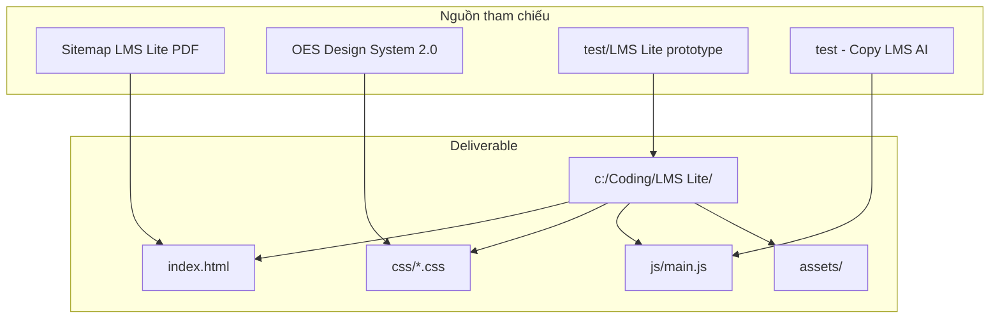

# Kế hoạch: Trang web giới thiệu LMS Lite

## Bối cảnh

Đã có prototype tốt tại [`test/LMS Lite`](c:\Coding\test\LMS Lite) (HTML/CSS/JS + font Gilroy + 2 ảnh mockup). Folder mới **`c:\Coding\LMS Lite`** sẽ là bản production: port nội dung đúng PDF, tinh chỉnh UI theo design system, và tách phong cách khỏi [`test - Copy`](c:\Coding\test - Copy) (LMS AI — dark hero, particles, branding AI).



---

## Cấu trúc folder

```
c:\Coding\LMS Lite\
├── index.html
├── css/
│   ├── variables.css    # token màu, font, spacing (bội 8)
│   ├── base.css         # reset, typography, grid 12 cột
│   ├── components.css   # btn, card, form, nav, modal
│   └── sections.css     # hero, USP, features, process, clients, CTA
├── js/
│   └── main.js          # nav, feature tabs, marquee, form
└── assets/
    ├── font/            # copy SVN-Gilroy từ test/LMS Lite/assets/font
    ├── hero_dashboard.png
    ├── student_learning.png
    └── features/        # ảnh minh họa từng phân hệ (Unsplash/Pexels, tone xanh-trắng)
```

---

## Nội dung 7 block — khớp PDF từng chữ

| Block | Nội dung chính (giữ nguyên copy PDF) |
|-------|--------------------------------------|
| **Hero** | CTA: *Nhận demo*, *Đăng ký tư vấn cùng chuyên gia*; headline + giá trong Block 1 |
| **Block 1 — Giới thiệu** | *Bắt đầu với LMS mà không cần đầu tư ngân sách lớn* / *Trải nghiệm hệ thống LMS FULL tính năng cơ bản chỉ 3.000.000 VNĐ/3 tháng* / *LMS Lite phù hợp với nhóm khách hàng nào?* / *Mở ra cách tiếp cận LMS đơn giản...* + 5 nhóm KH + CTA *Liên hệ tư vấn!* |
| **Block 2 — USP** | 4 lợi thế (tiêu đề + mô tả đúng PDF) |
| **Block 3 — Key features** | Tab dọc Admin (11 mục) + Học viên (9 mục); click hiển thị ảnh minh họa; nút *TÌM HIỂU THÊM* |
| **Block 4 — Giao diện** | *GIAO DIỆN HỆ THỐNG LMS LITE* / *SHOW HỆ THỐNG - CAP MÀN HÌNH DASHBOARD* |
| **Block 5 — Quy trình** | 8 bước triển khai (đúng PDF) |
| **Block 6 — Client** | *Khởi đầu phù hợp cho hơn 50+ cá nhân/đơn vị vừa & nhỏ* + logo chạy ngang |
| **Block 7 — Form** | Headline + 6 giá trị OES + form tư vấn |

**Lưu ý nội dung:** Bỏ các text không có trong PDF (badge *Hệ thống LMS thông minh*, floating stats *1,250+ học viên*, mô tả tính năng tự viết trong `script.js` của prototype). Khi click tính năng chỉ hiển thị **tên tính năng** (đúng PDF) + ảnh minh họa — không thêm đoạn mô tả sáng tác.

---

## Design System OES 2.0

Áp dụng từ [design system PDF](c:\Users\Setup Admin\Downloads\oes-vn-zuWRsaNcP809Kl0Okv8ESaeOhgNNI4fWOGetPwQ8fbig3JEz5r-#....pdf) và [oes.vn design page](https://oes.vn/zuWRsaNcP809Kl0Okv8ESaeOhgNNI4fWOGetPwQ8fbig3JEz5r/#intro):

**Màu sắc** (`variables.css`):

| Token | Hex | Vai trò |
|-------|-----|---------|
| `--color-dollar-bill` | `#93be5e` | accent nhẹ, border card |
| `--color-green-cyan` | `#00926c` | CTA chính, header section |
| `--color-pigment` | `#00aa54` | hover, highlight giá |
| `--color-castleton` | `#0E5C45` | text heading trên nền sáng |
| `--color-culture` | `#f3f5f6` | nền section xen kẽ |
| `--color-white` | `#ffffff` | nền chính |
| `--color-ufo` | `#3dd477` | accent phụ (icon, badge) |
| Secondary (tiết chế) | `#ffea60`, `#ed9d3e` | highlight số *70%*, giá |

**Typography:** `@font-face` SVN-Gilroy (copy từ `test/LMS Lite/assets/font`), fallback Plus Jakarta Sans. Body 16px, `line-height: 1.45` (130–150% tiếng Việt), `max-width: 65ch` cho đoạn văn, căn trái.

**Layout:** Container `max-width: 1200px`, padding bội 8 (16/24/32/48/64/80px), grid 12 cột responsive.

**OES visual layers (đơn giản hóa cho web):**
- Nền gradient xanh-trắng hero (Layer 1)
- Halftone pattern SVG mờ (Layer 4) — điểm nhận diện OES, không lấn át nội dung
- Không dùng particles/dark mode như LMS AI

---

## Phân biệt với LMS AI (`test - Copy`)

| Khía cạnh | LMS AI | LMS Lite (mới) |
|-----------|--------|----------------|
| Tone | Công nghệ AI, tối, gradient tím | Giáo dục, sáng, xanh lá-trắng |
| Hero | Particles, brain icon, stats 100+/100K | Ảnh dashboard + giá 3M/3 tháng nổi bật |
| Icon set | Boxicons + AI motifs | Font Awesome / Boxicons giáo dục đơn giản |
| Feature tabs | 3 tab (Learner/Admin/AI) | 2 nhóm (Administrator / Học viên) theo PDF |
| Branding | OES WeLearning AI | OES LMS Lite |

---

## UI/UX — dễ scan, nổi bật thông tin quan trọng

1. **Hero:** Giá `3.000.000 VNĐ/3 tháng` trong badge lớn màu `--color-pigment`; 2 CTA rõ ràng.
2. **Block 1:** Grid 5 card đối tượng KH — icon + tiêu đề bold + 1 dòng mô tả; layout tham khảo header [360learning LMS](https://360learning.com/product/learning-management-system/) (text trái / visual phải).
3. **Block 2 USP:** 2×2 card với số thứ tự; highlight *70%* bằng `--color-corn`.
4. **Block 3 Features:** Sidebar dọc scrollable + preview ảnh bên phải (Admin) / trái (Học viên) như PDF; active state nền xanh.
5. **Block 5 Process:** Timeline 8 bước dạng stepper ngang (desktop) / dọc (mobile).
6. **Block 6:** Marquee logo SVG placeholder (giữ pattern từ prototype).
7. **Sticky nav** với anchor jump; CTA *Nhận demo* luôn hiển thị.

---

## Form đăng ký

Dùng **cùng cấu trúc form** như LMS AI trong [`test - Copy/index.html`](c:\Coding\test - Copy\index.html) (dòng 1332–1388):
- Họ và tên, Tên doanh nghiệp, SĐT, Email, Quy mô nhân sự (select), Nhu cầu (textarea)
- Submit mô phỏng success state (pattern từ [`test - Copy/script.js`](c:\Coding\test - Copy\script.js))
- Modal *Nhận demo* dùng form tương tự
- Copy PDF cho phần info bên trái (6 commit items)

---

## JavaScript (`main.js`)

- Mobile hamburger + smooth scroll + header shrink on scroll
- Feature tabs: switch Admin/Học viên + click item → đổi ảnh preview
- Logo marquee infinite scroll (CSS animation + duplicate track)
- Form submit → success UI (giống LMS AI)
- `IntersectionObserver` fade-in nhẹ cho section (tùy chọn, không quá phức tạp)

---

## Ảnh minh họa

1. Copy `hero_dashboard.png`, `student_learning.png`, fonts từ [`test/LMS Lite/assets`](c:\Coding\test\LMS Lite\assets)
2. Bổ sung ~20 ảnh trong `assets/features/` từ Unsplash/Pexels (dashboard, e-learning, classroom) — chỉnh overlay xanh nhẹ cho đồng bộ tone OES
3. Block 4 dùng `hero_dashboard.png` trong browser mockup frame

---

## Kiểm tra sau khi build

- Mở `index.html` trên Chrome — responsive 375px / 768px / 1280px
- Đối chiếu từng block với PDF (không thiếu/thừa copy)
- Contrast text đạt WCAG (Castleton `#0E5C45` trên `#f3f5f6` / `#ffffff`)
- Form hoạt động (success state), feature tabs chuyển ảnh mượt
