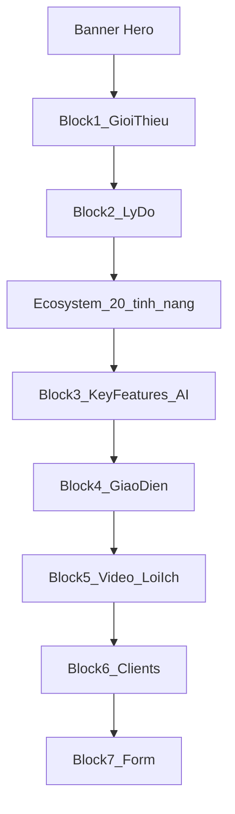

# Trang giới thiệu LMS Đại học - Cao đẳng

## Mục tiêu

Tạo landing page HTML/CSS/JS trong folder mới [`test - Copy/LMS ĐH-CĐ/`](test - Copy/LMS ĐH-CĐ/) — song song với [`test - Copy/LMS AI/`](test - Copy/LMS AI/), **không** sửa [`LMS Lite/`](LMS Lite/) ở root (sản phẩm SME khác).

**Branding:** "LMS cho trường Đại học - Cao đẳng" / "OES LMS ĐH-CĐ".

**Nội dung:** Giữ nguyên văn từng chữ từ PDF [`[OES] Sitemap LMS product - LMS Đại học - CĐ.pdf`](c:\Users\Setup Admin\Downloads\[OES] Sitemap LMS product  - LMS Đại học - CĐ.pdf). Placeholder `[số]` → số marketing OES mẫu:
- **100+** khách hàng — Triển khai hệ thống LMS ĐH - CĐ
- **500.000+** users — Tham gia học tập và phát triển năng lực
- **95%** hài lòng — Đánh giá tích cực từ khách hàng thực tế của OES

**Lưu ý:** Folder [`test - Copy/LMS Lite/`](test - Copy/LMS Lite/) chỉ có fonts (scaffold dở) — sẽ **không** dùng; triển khai hoàn chỉnh trong `LMS ĐH-CĐ`.

---

## Cấu trúc thư mục

```
test - Copy/LMS ĐH-CĐ/
├── index.html
├── css/
│   ├── variables.css
│   ├── base.css
│   ├── components.css
│   └── sections.css
├── js/
│   └── main.js
└── assets/
    ├── font/              # SVN-Gilroy từ LMS Lite root
    ├── hero_dashboard.png
    ├── showcase_dashboard.png
    └── features/          # 15+ screenshot từ LMS Lite root
```

Copy assets từ [`c:\Coding\LMS Lite\assets\`](LMS Lite/assets/).

---

## Bố cục 7 blocks (theo PDF)



| Block | Nội dung chính | UI pattern |
|-------|----------------|------------|
| Hero | H1 + Thông tư 30/2023/TT, ảnh dashboard, CTA "Nhận demo" / "Đăng ký tư vấn cùng chuyên gia" | 2 cột, halftone bg, tham khảo [360learning header](https://360learning.com/product/learning-management-system/) |
| 1 | "Đồng hành cùng nhà trường..." + 3 stat cards | Nền `#f3f5f6`, counter animation |
| 2 | So sánh ❌ (5) vs ✅ (7) + tiêu đề ecosystem 20+ | `.why__comparison` từ [`test - Copy/LMS AI/styles.css`](test - Copy/LMS AI/styles.css), gạch xám mờ giữa |
| 2b | Tab Sinh viên (8) / Giảng viên-Admin (4) | Sidebar dọc + preview ảnh + mô tả + bullets; pattern từ [`LMS Lite/js/main.js`](LMS Lite/js/main.js) |
| 3 | Virtual Classroom, Báo cáo, Bảo mật + 4 AI cards | 3 feature cards + icon grid AI |
| 4 | GIAO DIỆN HỆ THỐNG LMS... | Browser mockup + `showcase_dashboard.png` |
| 5 | Video HDSD (iframe placeholder) + 7 lợi ích | 16:9 video + icon-list 2 cột |
| 6 | Logo trường placeholder | Grid 6–8 ô grayscale |
| 7 | Trust pillars + form mock + "Đồng hành cùng nhà trường" | 2 cột: pillars trái, form phải |

### Feature tabs — mapping ảnh

**Sinh viên:** `student-dash`, `library`, `student-courses`, `online-exam`, `forum`, `ai-tutor`, `gamification`, `student-results`

**Giảng viên/Admin:** `dashboard`, `course-builder`, `question-bank`, `learning-reports`

Mỗi item chứa: tiêu đề, đoạn mô tả, bullets `- ...` nguyên văn PDF. CTA **TÌM HIỂU THÊM** tại item 1 & 5 (Sinh viên) và item 1 (Admin).

---

## Design System OES 2.0

Tham chiếu [oes.vn Design System](https://oes.vn/zuWRsaNcP809Kl0Okv8ESaeOhgNNI4fWOGetPwQ8fbig3JEz5r/#intro) và [`LMS Lite/css/variables.css`](LMS Lite/css/variables.css):

- **Primary:** `#93be5e`, `#00926c`, `#00aa54`
- **Text/Bg:** `#ffffff`, `#f3f5f6`, `#0E5C45` (Castleton headings)
- **Font:** SVN-Gilroy (Regular/Medium/Bold/Heavy)
- **Grid:** spacing bội 8, container max 1200px
- **Patterns:** halftone dots hero, gradient CTA `#93be5e → #00926c`, scroll reveal, sticky nav

Tái sử dụng trực tiếp/adapt từ [`LMS Lite/css/`](LMS Lite/css/):
- `variables.css`, `base.css`, `components.css` — gần như copy nguyên
- `sections.css` — mở rộng thêm: `.why__*`, `.stats__*`, `.key-features__*`, `.ai-grid__*`, `.benefits__*`, `.video__*`

---

## JavaScript ([`js/main.js`](test - Copy/LMS ĐH-CĐ/js/main.js))

1. Mobile nav + sticky header
2. Active nav link on scroll
3. Segment tabs: Sinh viên ↔ Giảng viên/Admin
4. Feature click → đổi ảnh, tiêu đề, mô tả, bullets (data attributes hoặc hidden JSON)
5. Stats counter (100, 500000, 95)
6. Modal "Nhận demo"
7. Form submit mock → success message
8. IntersectionObserver scroll reveal

---

## Responsive

- **Desktop:** hero 2 cột, comparison side-by-side, feature sidebar + preview
- **Tablet (≤1024px):** stack hero, giữ comparison 2 cột
- **Mobile (≤768px):** comparison vertical, feature accordion, stats 1 cột, form full-width

---

## Ngoài scope

- Backend / form embed OES thật
- Logo trường ĐH-CĐ thật (placeholder)
- Video YouTube URL chính thức (placeholder iframe)
